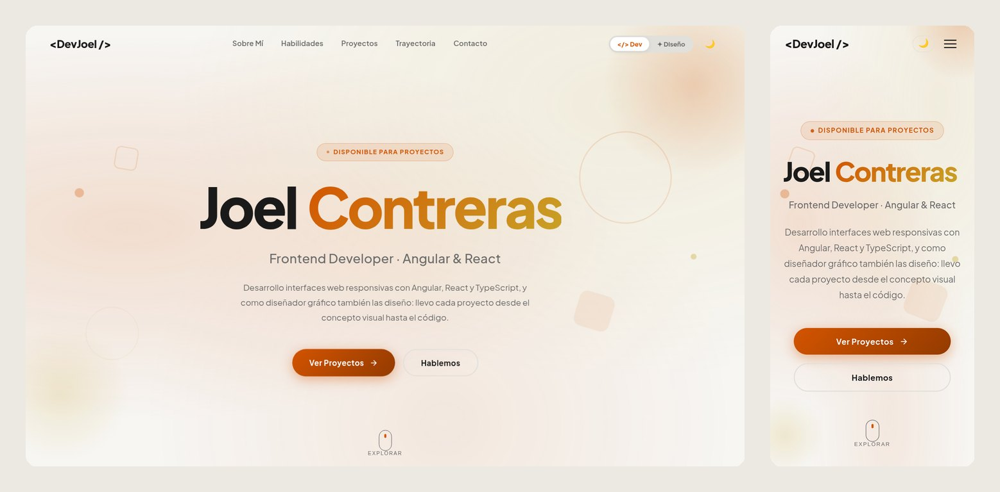
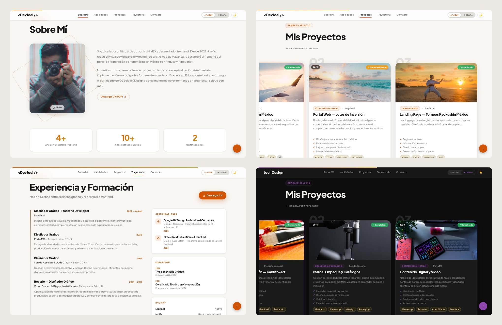

# Joel Contreras — Portafolio

**Frontend Developer (Angular, React) y Diseñador Gráfico.** Portafolio personal con dos perfiles, desarrollador y diseñador, que se cambian desde el menú: cada uno tiene su propio color, textos, proyectos y habilidades.

🔗 **En vivo: [ex1ma.github.io](https://ex1ma.github.io/)**



## Qué incluye

- **Dos perfiles, Dev y Diseño**, con transición animada entre ellos.
- **Sobre Mí** con una tarjeta que gira al tocarla: ilustración al frente y foto al reverso.
- **Habilidades** en un carrusel infinito que se pausa al pasar el mouse.
- **Proyectos** con scroll horizontal fijado en escritorio (GSAP ScrollTrigger) y lista vertical en celular.
- **Trayectoria**: experiencia en línea de tiempo, certificaciones, educación, idiomas y CV descargable.
- **Contacto** con formulario que envía los mensajes por correo, con respaldo `mailto:` si el servicio falla.
- Modo claro y oscuro, diseño responsivo y cursor personalizado solo en equipos con mouse.
- Accesibilidad: respeta `prefers-reduced-motion`, se navega con teclado y los títulos animados tienen nombre accesible.
- Vista previa al compartir el link (Open Graph) y favicon propio.



## Stack

| | |
|---|---|
| UI | React 19 + TypeScript |
| Build | Vite 7 |
| Animación | GSAP (ScrollTrigger) y Framer Motion |
| Estilos | CSS Modules con variables de diseño (`src/global.css`) |
| Tipografía | Plus Jakarta Sans |
| Formulario | FormSubmit |
| Hosting | GitHub Pages, desplegado con GitHub Actions |

## Desarrollo local

La app vive en la carpeta `Portafolio/`.

```bash
cd Portafolio
npm ci
npm run dev       # http://localhost:5173
npm run build     # compila a Portafolio/dist
npm run lint
```

## Cómo actualizar el contenido

Casi todo el contenido son datos, así que no hace falta tocar los componentes:

| Qué | Dónde |
|---|---|
| Textos del hero, "Sobre Mí", cifras, proyectos y habilidades (Dev y Diseño) | `Portafolio/src/data/portfolioData.ts` |
| Experiencia, educación, certificaciones e idiomas | `Portafolio/src/data/experience.ts` |
| Foto del reverso de la tarjeta | `Portafolio/src/assets/photo.jpg` (vertical 4:5) |
| Ilustración del frente | `Portafolio/src/assets/profile.jpg` |
| CV descargable | `Portafolio/public/cv-joel-contreras.pdf` |
| Imagen al compartir el link | `Portafolio/public/og.png` (1200×630) |
| Redes sociales del footer | `Portafolio/src/components/Footer.tsx` |

En un proyecto, `demoLink` y `repoLink` son opcionales. Si no hay ninguno, la tarjeta muestra "código privado" en lugar de los botones.

## Despliegue

Cada push a `main` ejecuta `.github/workflows/deploy.yml`: instala dependencias, compila `Portafolio/` y publica `Portafolio/dist` en la rama `gh-pages`, que es la que sirve GitHub Pages.

---

© Joel Contreras Bautista · [LinkedIn](https://www.linkedin.com/in/joel-contreras-bautista-06310b159) · [Behance](https://www.behance.net/VereorNox) · [GitHub](https://github.com/EX1MA)
